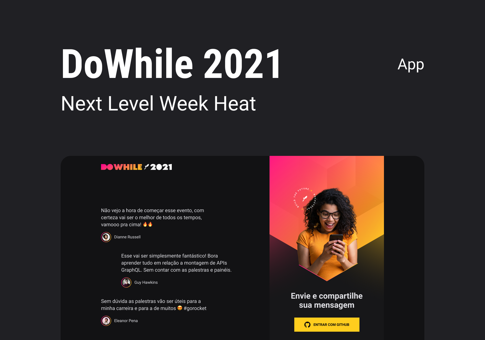

<p align="center">
  
</p>

<h1 align="center">
    
</h1>

<br>

## Tecnologias

Esse projeto foi desenvolvido com as seguintes tecnologias:

[](https://reactnative.dev/)
[](https://socket.io/)
[](https://vitejs.dev/)
[](https://www.typescriptlang.org/)

## Como executar

Clone o projeto e acesse a pasta do mesmo.

```bash
$ git clone https://github.com/BhryanS2/nlw-heat-mobile
$ cd nlw-heat-mobile
```

Para rodar em sua máquina rode:

```bash
$ yarn
# Para instalar as dependências.
```

Depois de isntalar as instalar as dependências.\
Digite no terminal:

```bash
# Para iniciar o projeto
$ expo start
```

o expo abrirá no seu browser o projeto.
Abra então o expo go no seu celular físico e mire no qr-code.
Se usa um emulador, basta rodar ele e na página do browser onde está o qr-code, clilcar em run-emulator.

## Projeto

é uma applicação que acontece via websocket, onde um usuário pode mandar uma menssagem e ela aparecerá em uma lista de mensssagens
